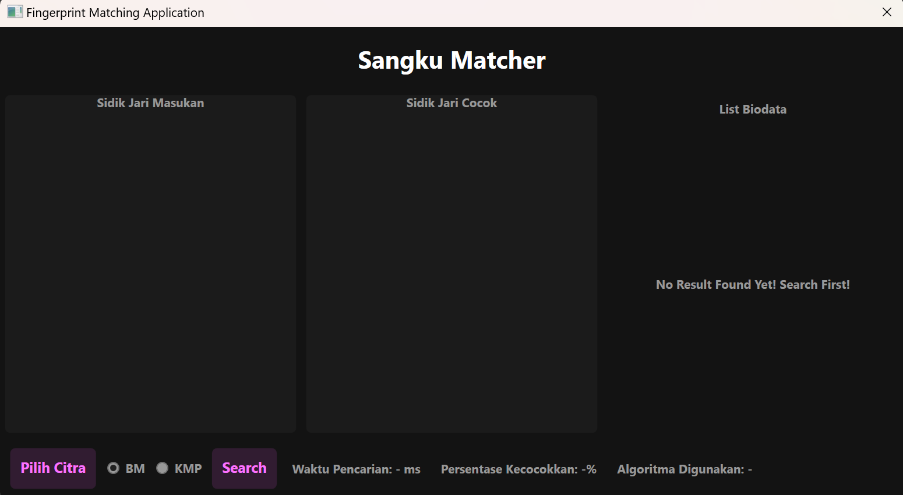
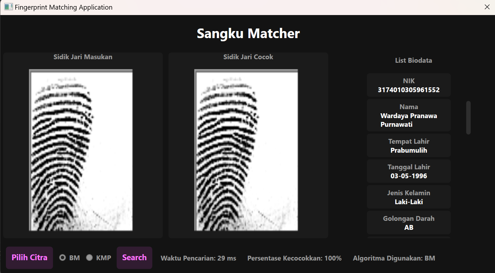
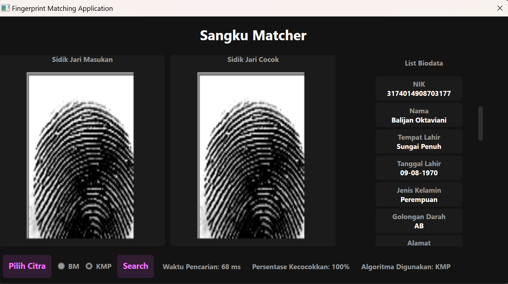

<h1 align="center">Tugas Besar 3 IF2211 Strategi Algoritma</h1>
<h2 align="center">Semester II Tahun 2023/2024</h2>
<h3 align="center">Utilization of Pattern Matching in Building Biometric-Based Individual Detection System Through Fingerprint Images</h3>


## Table of Contents
* [Overview](#Overview)
* [Technologies Used](#technologies-used)
* [Features](#features)
* [Setup](#setup)
* [How to Use the Program](#how-to-use-program)
* [Creator](#creator)
* [Documentation](#documentation)
* [Links](#links)

## Overview
In today's digital age, data security and access control have become paramount. As technology advances, it opens up opportunities for sophisticated and practical identification methods. Traditional methods like passwords or PINs often suffer from drawbacks such as being easily forgotten or stolen. Biometrics has emerged as a popular alternative, offering a secure method of access control. Among biometric technologies, fingerprint identification is widely used due to its uniqueness and reliability.

This project implements a biometric identification system using fingerprint recognition. The system utilizes pattern matching techniques to match captured fingerprints against registered patterns in the database. Common pattern matching algorithms used include Boyer-Moore and Knuth-Morris-Pratt, allowing the system to recognize fingerprints quickly and accurately, even if the captured prints are imperfect.

By integrating fingerprint identification and pattern matching technology, this system aims to provide a secure, reliable, and user-friendly biometric identification solution applicable in various domains such as access control, employee attendance, and financial transaction verification.

## Technologies Used
### Dotnet/C#
The backend logic, including the pattern matching algorithms like Boyer-Moore and Knuth-Morris-Pratt, is implemented in C#. This choice leverages C#'s robustness and platform-independent capabilities, making the system reliable and maintainable.

### WPF Application
The graphical user interface (GUI) of this system is developed using Windows Presentation Foundation (WPF), a framework for building high-quality user interfaces in Windows applications. WPF allows for a modern, rich user experience, supporting both the design and functionality of our biometric identification system.

### PostgreSQL
PostgreSQL is used as the database system for storing fingerprint data and associated user identities. Known for its reliability and robustness, PostgreSQL ensures that data handling is secure and efficient, crucial for the integrity and performance of identification systems.

### Prerequisites
To successfully set up and run this project, ensure that the following prerequisites are met:
- **Dotnet**: This is required to compile and run the C# backend and WPF application. Ensure that your system has Dotnet installed and configured properly.

To install Dotnet, you can follow the official Microsoft guidelines available at [Dotnet Installation Guide](https://dotnet.microsoft.com/en-us/download).

## Features
- **Algorithms**: This system employs three different algorithms for effective fingerprint pattern matching and identification and also the regex algorithm:
  - **Knuth-Morris-Pratt (KMP)**:
    - Utilizes a partial match table to determine the next positions to skip to after a mismatch, optimizing the search process.
    - Efficient in scenarios with repetitive patterns, reducing unnecessary comparisons, thus providing consistent and reliable performance.

  - **Boyer-Moore (BM)**:
    - Employs the bad character heuristic to skip sections of the text that are mismatched, leading to potentially faster search times than KMP.
    - Particularly effective for long text searches where the pattern and mismatches are clear, but may not perform optimally on short searches or those with many repeated patterns.

  - **Levenshtein Distance (LD)**:
    - Calculates the minimum number of single-character edits (insertions, deletions, or substitutions) required to change one word into another.
    - Useful for measuring the similarity between the entered fingerprint and stored prints, accommodating inaccuracies or partial prints effectively.

  - **Regular Expressions (Regex)**:
    - Leverages patterns to match or replace text based on predefined rules and characters.
    - Extremely versatile for validating and parsing text, allowing complex search patterns that are concise yet expressive.
    
- Each algorithm offers a unique approach to solving fingerprint identification problems, showcasing the strengths and weaknesses of each method and providing a robust solution when combined.

## Setup
To get started, you can clone the repository and run the application.

1. Clone the repository
```bash
https://github.com/Filbert88/Tubes3_Sangku.git
``` 
2. Enter the directory
```
cd src
```

3. To run the GUI
```
dotnet run
```

## How to Use the Program
1. **Choose a Photo**: Select a photo from your directory, ensuring it is in BMP format.
2. **Select the Algorithm**: Choose either the KMP or BM algorithm for the pattern matching process.
3. **Execution**: After running the program, it will display all the biodata associated with the matched fingerprint.
  
## Creator
| NIM      | Nama    | Kelas |
| -------- | ------- | ----- |
| 13522019 | Wilson Yusda | K-01  |
| 13522021 | Filbert | K-01  |
| 13522073 | Juan Alfred Widjaya | K-01  |
| 10023457 | Habibi Galang Trianda | K-01  |

## Documentation
### Graphical User Interface (GUI)




## Links
- Repository : https://github.com/Filbert88/Tubes3_Sangku.git
- Issue tracker :
  - If you encounter any issues with the program, come across any disruptive bugs, or have any suggestions for improvement, please don't hesitate to reach out by sending an email to filbertfilbert21@gmail.com. Your feedback is greatly appreciated.
